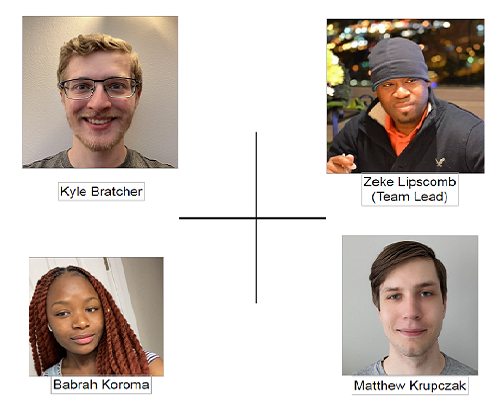

# Home

Adversarial Attacks in ML based Remote Sensing applications undergraduate research project for CS4850.

## Team

### Zeke Lipscomb

**Roles:** Lead the team 
and own administrative aspects of the project 
**Email:** [zekeclass@gmail.com](mailto:zekeclass@gmail.com)

### Babrah Koroma

**Roles:** Administrative and Data Science assistance 
**Email:** [Babrah.6766@gmail.com](mailto:Babrah.6766@gmail.com) 
**LinkedIn:** [Babrah Koroma](https://www.linkedin.com/in/babrahkoroma/)

### Matthew Krupczak

**Roles:** Individual Contributor for code 
**Email:** [matthew@krupczak.org](mailto:matthew@krupczak.org) 
**LinkedIn**: [Matthew Krupczak](https://www.linkedin.com/in/matthew-krupczak/)

### Kyle Bratcher

**Roles:** Individual Contributor for code 
**Email:** [kbratch1@students.kennesaw.edu](mailto:kbratch1@students.kennesaw.edu)

### Dr. Kazi Aminul Islam

**Roles:** Provide direction for the project and set goals 
**Email:** [kislam4@kennesaw.edu](mailto:kislam4@kennesaw.edu)
